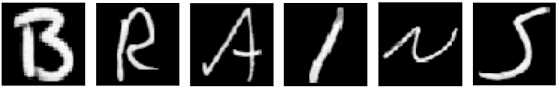
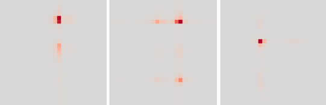

# basicNIF

This is a basic implementation of a Neural Information Flow (NIF) model. For all details of the framework, check this paper: 

Seeliger, K., Ambrogioni, L., Güçlütürk, Y., Güçlü, U. & van Gerven,
M. A. J. (2019). **Neural System Identification with Neural Information Flow.** bioRxiv 553255; doi: https://doi.org/10.1101/553255

The code implements NIF on two voxel populations (V1 and V2) from functional MRI data, stimulated by images of six handwritten characters: 

The model consists of two layers, representing information processing inside and between V1 and V2. The layers are connected to the V1 and V2 voxels via observation models based on low-rank tensor decomposition, which will learn spatial and channel receptive fields. *The sole training signal for the neural network layers and the observation models comes from the training objective of predicting how voxels react to stimuli.* So you e.g. will learn representations directly on your data, and there are no artificial assumptions about visual system learning goals (such as classifying ImageNet). You will furthermore learn retinotopy and effective connectivity, all within the same model. 

Although the data set is quite small, quite a few voxels can be predicted with correlations above 0.3. These voxels also produce stable spatial receptive fields. Here are three examples from V1: 

To get rid of the symmetric artefacts, and for learning more complex (multi-pole) receptive fields that exist in MRI data you will need to increase the rank. Every additional rank will add another set of observation weights for every voxel however, so your available number of training samples must permit this. 

The code will also write a few channel weights learned in V1 (however this example uses tiny 3 x 3 channels, so there is not much to see here). The model is not using a retina transform on the input stimuli, however it is recommended (nice recent implementation: https://github.com/dicarlolab/retinawarp ). 

Usage conditions
================

If you publish using this code or use it in any other way, please cite:

Seeliger, K., Ambrogioni, L., Güçlütürk, Y., Güçlü, U. & van Gerven,
M. A. J. (2019). **Neural System Identification with Neural Information Flow.** bioRxiv 553255; doi: https://doi.org/10.1101/553255

The complete BRAINS data set (V1 and V2 stimulated by 6 handwritten characters) is available on Donders Repository: 
http://hdl.handle.net/11633/di.dcc.DSC_2018.00114_120

When using the complete BRAINS data set or the part extracted for this repository, please refer to the following two articles:

Schoenmakers, S., Barth, M., Heskes, T., & van Gerven, M. (2013). **Linear reconstruction of perceived images from human brain activity.** NeuroImage 83, 951-961.

Schoenmakers, S., Güçlü, U., van Gerven, M., & Heskes, T. (2014). **Gaussian mixture models and semantic gating improve reconstructions from human brain activity.** Frontiers in Computational Neuroscience 8, 173.

In any case, the corresponding authors will appreciate if you let them know how you made use of their work. 
